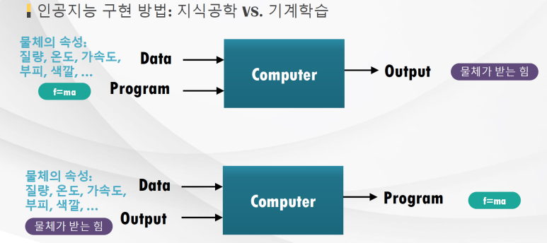
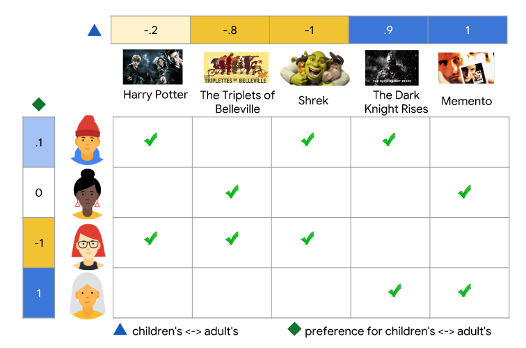



# [Tacademy] 인공지능을 위한 머신러닝 알고리즘 - 01강 머신러닝 개요

## **# 인공지능 달성 수단으로써의 머신러닝**

**※ 지능**

  · 문제를 해결할 수 있는 능력

**※ 인공 지능**

  · 지능 작업을 수행할 수 있는 기계의 능력

  · 입력 값에 따라 적절한 출력을 결과로 내는 것

**※ 인공지능 구현 방법**

  · 합리주의자 : Top-down 방식, 지식 공학, 학문 연구나 실무 경험으로 터득한 지식을 컴퓨터에 입력

  · 경험주의자 : Bottom-up 방식, 머신 러닝, 컴퓨터가 데이터로부터 지식을 직접 학습

출처 : 강의 교재 중 캡처 / 합리주의자 방식(위) & 경험주의자 방식(아래)

## **# 머신러닝 알고리즘의 종류와 차이점**

**※ 학습 방법**

  · 지도 학습 : 학습 데이터가 레이블(정답)을 가지고 있지 않음

  · 비지도 학습 : 학습 데이터가 레이블을 가지고 있지 않음

  · 준지도 학습 : 학습 데이터가 약간의 레이블을 가지고 있음

  · 강화 학습 : 최종 출력이 바로 주어지지 않고 시간이 지나서 주어지는 경우

**※ 지도 학습**

  · 주어진 입력-출력 쌍들을 매핑해주는 함수를 학습

  · 새로운 데이터의 출력을 학습한 함수를 사용하여 예측

  · 이산적이면 분류(Classification) 문제, 연속적이면 회귀(Regression) 문제, 확률이면 추정(Estimation) 문제

  · 각 데이터마다 정답 레이블이 주어지기 때문에 정확한 학습을 할 수 있음

  · 우리 생활에 정답이 존재하는 데이터는 한정적이기 때문에 사용하기 위한 데이터를 생성하기 위해서는 비용이 많이 필요하고, 따라서 사용할 수 있는 데이터에 한계가 있음

**※ 비지도 학습**

  · 입력만 있고 출력은 없는 상태에서 이뤄지는 학습

  · 따라서 데이터에 내재된 고유의 특징을 탐색해야 함

  · 주로 비슷한 데이터끼리 묶는 분류 문제(클러스터링)이 주로 사용됨

  · 지도학습에 비해서는 학습이 어렵지만, 앞으로 머신러닝이 풀어야 할 중요한 숙제

**※ 강화 학습**

  · 출력이 하나의 Action의 직후에 나오지 않고, 특정 상황에 Reward를 최대화 할 수 있는 방향으로 정해짐

## **# 일상 생활 속 머신러닝 예제**

**※ Netflix의 추천 시스템**

  · Collaborative Filtering

출처 : https://developers.google.com/machine-learning/recommendation/collaborative/basics

**※ 미국 국가안보국의 SKYNET**

  · 테러리스트 식별 및 사살 프로그램

## **# 머신러닝의 구성 요소**

**※ 데이터**

  · 훈련 데이터 : 모델 학습을 위해 사용하는 데이터

  · 검증 데이터 : 모델 검증을 위한 데이터, 검증 데이터에 대한 성능에 따라 최종 모델 선택

  · 테스트 데이터 : 선정 모델의 최종 성능 검사를 위한 구별 해 놓거나 실제 상황의 데이터

**※ 모델 표현 방법**

  · 의사 결정 트리

  · 신경망 기반

  · KNN, SVM

  · 베이지안

  · 유전 알고리즘

  · 앙상블

**※ 모델 평가 방법**

  · 에러의 제곱(Squared Error)

  · 정확도(Accuracy)

  · 우도(Likelihood)

  · 정밀도(Precision)와 재현률(Recall)

  · 엔트로피(Entropy)

  · 사후 확률(Posterior Probability)

