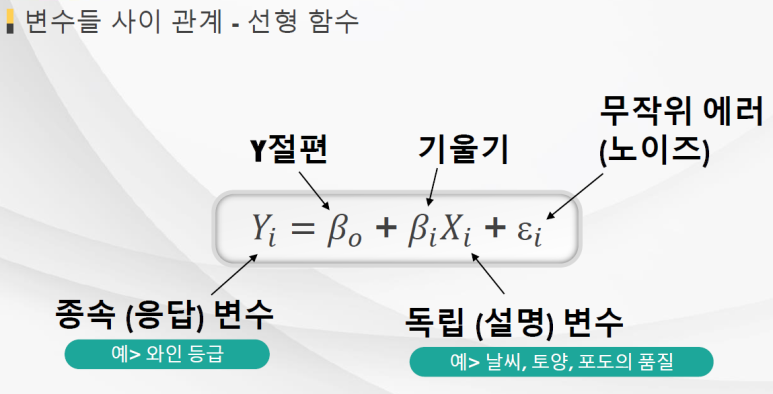
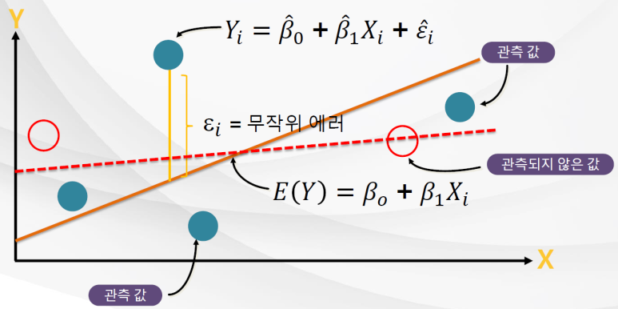



# [Tacademy] 인공지능을 위한 머신러닝 알고리즘 - 02강 선형 회귀 모델

## **# 선형 회귀 모델**

**※ 정의**

  · 한 개의 종속 변수와 한개 또는 그 이상의 설명(독립) 변수들과의 관계를 모델링 한 것

  · 관계 정의를 위해 설명 변수를 원인으로, 종속 변수를 결과로 둔 방정식 사용

  · 예측이나 추정 문제에 사용

****

**※ 선형성**

  · Y = aX + b와 같은 1차 방정식으로 나타낼 수 있는 관계

출처 : 강의 교재 중 캡처 / 선형 함수에 대한 정리

**※ 선형 회귀 모델의 확률적 관점**

  · 전체 데이터 중 일부 관측 값(샘플 데이터)를 기반으로 규칙을 추론

출처 : 강의 교재 중 캡처 / 확률적 관점에서의 선형 회귀

## **# 파라미터 예측, 최소 제곱 방법**

**※ 최소 제곱**

  · 실제 Y값과 예측된 Y값의 차이를 '에러'라고 할 때, 이 값이 최소가 되어야 모델의 성능이 좋은 것

  · 에러의 값은 양수가 되어야 하기 때문에 제곱을 취한 것

  · 최소 제곱 방법은 에러 제곱의 합(SSE; Sum of the Squared Errors)을 최소화 시킴

  · 에러를 최소화 할 수 시키는 적절한 파라미터를 찾는 것이 성능 좋은 회귀 모델을 만드는 것

## **# 선형 회귀 모델의 한계**

**※ 선형성의 한계**

  · 독립 변수에 귀결되는 결과가 S자로 분포된다면 선형회귀로 해결할 수 없음

  · 이는 로지스틱 회귀 모델로 접근해야 함