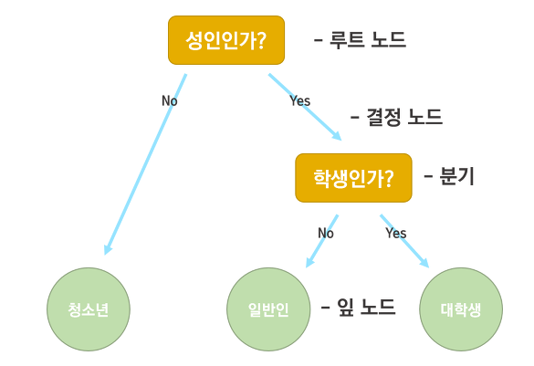
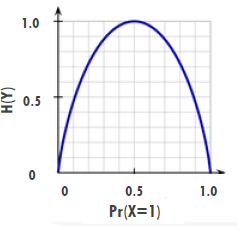



# [Tacademy] 인공지능을 위한 머신러닝 알고리즘 - 04강 결정 트리

## **# 의사 결정 트리와 분류 문제**

**※ 분류(Classification)**

  · 훈련 데이터의 특성 값(X)과 클래스 정보(Y)를 학습한 뒤, 새롭게 주어지는 테스트 데이터부터는 특성 값만으로 클래스를 예측하는 것

  · 즉, 설명(독립) 변수와 종속 변수간의 관계를 찾는 함수를 학습하는 것

**※ 필요 사항**

  · 특성 값은 고정된 집합의 특성들로 표현될 수 있어야 함

  · 클래스는 이산 출력 값을 가져야 함

  · 결정 트리에 주어질 충분한 훈련 예제(데이터)가 필요함

**※ 결정 트리**

  · 트리 구조를 갖는 분류기

  · 루트 노드부터 시작해서 특성 값에 따라 적절한 말단 노드에 도착함으로써 새로운 데이터의 클래스를 분류

**※ 결정 트리의 구성요소**

출처 : https://gomguard.tistory.com/86

  · 결정 노드 : 단일 특성에 대해 데이터를 테스트(분류)하는 단계

  · 말단 노드 : 클래스를 나타내는 마지막 단계

  · 엣지(Edge) : 하나의 특성 값을 분류

  · 경로(Path) : 최종 분류 결정을 하기 위한 룰들의 논리 합(Disjunction)

**※ 결정 트리 구성 시 고려 사항**

  · 어느 특성을 루트 노드로 설정할 것인가?

  · 중간 노드들의 순서는 어떻게 배치하는가?

  · 노드를 얼마나 만들어야 하는가?

**※ 랜덤 결정 트리**

  · 트리의 크기가 매우 커질 수 있고, 분류의 룰을 이해하기 어려울 수 있음

  · 크기가 큰 트리는 보통 작은 트리보다 정확도가 떨어짐

## **# 결정 트리 구축 원칙**

**※ 결정 트리 구축 원칙**

  · 각 노드에서 테스트 할 특성 선택 : 분류할 때 가장 유용한 특성 순서대로 선택

  · 정보 획득량 : 각 특성들이 훈련 예제들을 얼만큼 잘 분류할 수 있는지 측정(수치적), 트리 구축 과정에서 테스트 할 후보 특성의 순서를 결정할 때 사용

  · 엔트로피 : 확률 변수의 불확실성을 수치로 나타낸 것

**※ 엔트로피의 직관적 이해**

  · 엔트로피가 0일 때, 출력은 매우 확실한 상태

  · 출력에 대해서 아무런 정보가 없을 때, 엔트로피는 최고 값을 가짐

  · 클래스가 두 개인 문제에서 하나의 클래스의 발생 확률에 대한 엔트로피의 변화

출처 : 강의 영상 캡처

**※ 정보 획득량**

  · 분류를 했을 때 감소하는 엔트로피로, 분류를 통해 감소되는 정보의 불확실성을 수치로 나타낸 것

  · 즉, 특성을 사용하여 데이터를 분류했을 때, 예상되는 엔트로피의 감소량을 뜻

  · 정보 획득량은 양수의 값을 가져야 함(분류를 통해 불확실성이 줄어들는 특성을 선택해야 함)

**※ 고려 사항 선택 기준**

  · 어떤 노드를 먼저 선택하는가? 결정 트리의 각 노드에서 가장 큰 정보 획드량을 갖는 특성을 선택

  · 얼마나 노드를 만들어야 하는가? (중단 기준) 모든 특성들이 트리의 경로에 포함되어야 하고, 말단 노드와 연관되어 있는 모든 훈련 데이터들이 같은 클래스로 해당되는 경우(이 때 엔트로피 값은 0)

**※ Occam의 면도날**

  · 필요하지 않는 가설을 잘라내는 것

  · 모든 것이 똑같은 조건일 때, 가장 쉬운 설명(가장 간단한 가설)을 선호

**※ 결정 트리 분류의 장점**

  · 분류 방법 중 상대적으로 빠르면서(계산량이 적어서) 성능이 좋음

  · 간단한 모델 구축 원리를 이해하기 쉬움

  · 모델이 분류하는 기준(rule)을 사람이 직관적으로 이해하기 쉬움

**※ 결정 트리 분류의 단점**

  · 연속적인 특성을 갖는 데이터에는 적합하지 않음

  · 클래스의 개수가 많거나 학습 데이터가 적으면 성능이 좋지 않음

  · 훈련 과정에서 트리의 노드 선택 순서를 정하기 위해 모든 특성의 정보 획득량을 계산한 뒤 정렬하기 때문에 계산량이 많음

**※ 특성이 연속된 값이라면?**

  · 연속된 값들을 이산적인 구간의 집합으로 나눔

  · 임계치(c)에 따라서 새로운 특성을 설정(예를 들어, c보다 크면 T 작으면 F로 분류)

  · 임계치 설정 방법 : 데이터를 특성 값에 따라 정렬시키고, 클래스가 다르면서 인접한 두 데이터를 찾고 이 부분의 정보 획득량을 계산... 정보 획득량이 가장 많은 임계치를 선택

## **# Bagging**

**※ Bootstrap Aggregating**

  · 다수의 분류기를 결합하는 앙상블 기법 중 하나

  · (위키 백과) "통계적 분류와 회귀 분석에서 사용되는 기게 학습 알고리즘의 안정성과 정확도 향상을 위해 고안된 일종의 앙상블 학습법의 메타 알고리즘이다. 또한 배깅은 분산을 줄이고 과적합을 피하도록 해준다."

