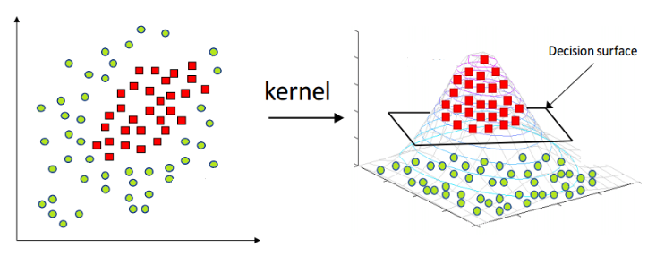
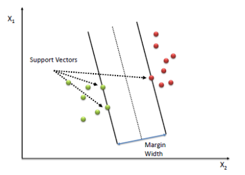
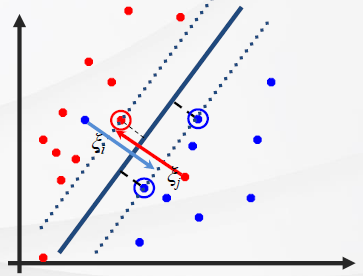



# [Tacademy] 인공지능을 위한 머신러닝 알고리즘 - 05강 서포트 벡터 머신

## **# 선형 분류기**

**※ 초평면 선택**

  · 초평면 : 데이터 임베딩 공간에서 한 차원 낮은 부분 공간(Subspace)

  · 여러 선형 분류기들이 있지만 항상 최적의 초평면을 찾지는 않음

  · 최적의 초평면 조건 : 초평면과 결정 영역 근처에 있는 데이터의 거리가 최대가 되어야 함

출처 : https://jihongl.github.io/2017/09/24/svm/

## **# 서포트 벡터 머신(SVM, Support Vector Machine)**

**※ SVM의 분류 원리**

  · 결정 영역의 초평면 두께(Margin)를 최대한 크게 가져가는 것

  · 클래스 결정 함수는 훈련 데이터의 부분 집합(서포트 벡터)만으로 완전히 설명 가능

  · SVM의 결정 함수를 구하는 것이 함수 최적화 문제

****

**※ SVM 형식**

  · 분류기 형식 : 𝒚𝒊 = f(𝒙𝒊) = sign(𝒘𝑻𝒙𝒊+ **b**)

  · sign 함수의 역할 : 연속적인 값을 갖지만 이산적으로 표현하기 위해서 수의 부호를 판별, 𝒘𝑻𝒙𝒊+ b의 값이 1 이상이면 +1, -1 이하이면 -1의 값을 갖게 함

  · 𝒙𝒊 의 기능적 마진 : 주어진 데이터 포인트가 적절하게 분류되었는지 가늠할 수 있는 테스트 함수의 역할, 값이 클수록 적절하게 분류된 것을 의미, 𝒘와 **b**의 값을 키워서 마진의 크기를 증가시킬 수 있음

**※ 기하 마진(Geometric Margin)**

$r\ =\ y\frac{\ (\combi{W}^Tx+b)}{\ \left|\left|\combi{W}\right|\right|}$r = y (WTx+b) ||W||

  · 데이터 포인트에서 결정 영역까지의 거리로, 기능적 마진을 𝒘의 크기로 나눈 것

출처 : https://ratsgo.github.io/machine%20learning/2017/05/23/SVM/ 

  · 서포트 벡터 : 결정 영역까지 가장 가까운 데이터들

  · 마진 : 클래스들의 서포트 벡터들 사이의 거리

## **# 비선형 분류기**

**※ 소프트 마진 분류(Soft Margin Classification)**

  · 훈련 데이터가 선형으로 분리되지 않는 경우, 변수를 사용하여 올바르게 분류하는 것

  · 즉, 오분류 된 데이터에 슬랙 변수를 추가하여 본래 속하는 클래스로 이동시키는 것

출처 : 강의 영상 캡처

**※ 결정 영역이 선형이 아닌 경우**

  · 데이터 포인트를 선형으로 분류하기 위해 차원을 더 생성(고차원으로 높임)