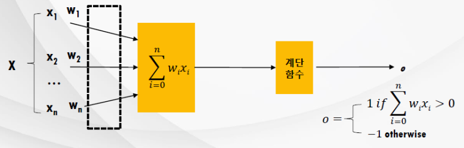

# [Tacademy] 인공지능을 위한 머신러닝 알고리즘 - 06강 신경망

## **# 뇌 & 컴퓨터**

**※ 뇌와 컴퓨터의 비교**

  · 뇌 : 100억 개의 뉴런, 60조 개의 시냅스, 분산 처리 방식, 비선형 연산, 병렬 처리

  · 컴퓨터 : 뉴런보다 빠른 연산*, 중앙 처리 방식(ALU), 산술 연산(선형), 순차 처리

​    cf) 연산 속도 : 뉴런 = 10-3초, 컴퓨터 = 10-9초

## **# 퍼셉트론**

**※ 인공 뉴런**

출처 : 강의 영상 캡처

  · 생물학적 뉴런의 구조를 모방하여 병렬 계산, 분산 표현 등을 구현

  · 입력 : 다른 신경세포들로부터 수상돌기를 통해 신경이 전달(입력) = 다른 뉴런으로부터 나오는 출력이 입력되는 것

  · 가중치 : 입력 값이 세포체에게 전달되는 것 = 입력 값에 대한 가중치 계산 함수

  · 출력 : 축삭 돌기에서 특정 조건에 대해서만 반응 = 활성화 함수에 따라 출력 진행

**※ 신경망 학습에 적합한 문제**

  · 학습해야 하는 현상이 여러 가지 속성(입력의 특성(차원)이 다수인 경우)에 의해 표현되는 경우

  · 학습 예제에 에러가 존재할 경우

  · 긴 학습 시간

  · 학습된 결과를 사람이 이해하는 것이 필요 없는 경우(이해하는 것이 불가능)

**※ 퍼셉트론(1957)**

출처 : 강의 영상 캡처

  · 입력 : 실수 값을 갖는 벡터

  · 모델 구성 : 연결 가중치, 임계치

  · 출력 : 1 또는 -1 (클래스가 2 이상인 경우도 존재)

  · 학습 방식 : 적절한 출력을 위한 알맞은 연결 가중치 탐색

**※ 비선형 함수(in 퍼셉트론)**

출처 : 강의 영상 캡처

**※ 퍼셉트론 학습 Rule**

  · 가중치 W*i* 의 값은 입력 값과 에러의 크기에 비례하고, 그 값의 일부분(작은 상수만큼)만 반영

  · 올바른 가중치를 찾아내기 위한 필요 사항 : 훈련 데이터가 선형 분리 문제여야 함, 충분히 작은 학습률

**※ 퍼셉트론의 한계**

  · 가능 : 선 하나로만 구분할 수 있는 문제

  · 불가능 : 다수의 선이 필요한 경우(비선형 결정 영역 필요)한 문제, XOR 문제

## **# 다층 신경망의 분류 원리**

**※ XOR 문제의 해결**

  · 모델에 은닉층을 추가함으로써 개선된 분류 결정 영역을 얻음

  · 여러 패턴들의 결정 형태

출처 : 강의 영상 캡처

**※ 다층 퍼셉트론(다층 신경망)의 특징**

  · 같은 층 안에서는 연결이 존재하지 않음

  · 입력층과 출력층 사이에는 직접적인 연결이 존재하지 않음(은닉층을 통한 연결)

  · 각 층 사이는 완전 연결(Fully-Connected)이 되어 있음

  · 입력층의 유닛 개수는 출력층의 유닛 개수와 같을 필요가 없고, 은닉층의 유닛 개수는 입력층 또는 출력층 보다 많거나 적어도 됨

**※ 은닉층 유닛의 표현**

  · 입력 값의 특성을 스스로 파악해서 Hidden Layer에 표현

  · 미리 정해준 Feature만을 사용하는 경우보다 유연

  · 미리 알 수 없는 특성을 파악하는 데에 유용

