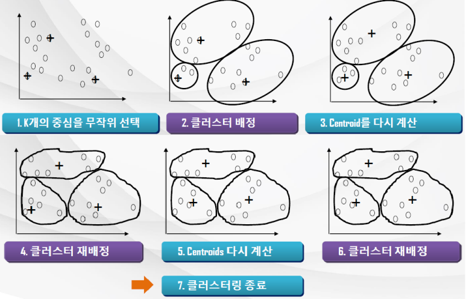



# [Tacademy] 인공지능을 위한 머신러닝 알고리즘 - 08강 비지도 학습

## **# 클러스터링**

**※ 클러스터링**

  · 데이터 사이에서 비슷한 그룹을 찾는 기법

  · 즉, 서로 비슷한 데이터끼리 하나의 클러스터로 묶고, 클러스터 별로 구분하는 것

  · 데이터 그룹을 묶을 수 있는 어떠한 사전 정보도 없기 때문에 비지도 학습

  · 일상에서 가장 많이 사용되는 데이터 마이닝 기법 중 하나

****

**※ 클러스터링 이슈**

  · 어떻게 그룹을 나눌 것인가?

  · 데이터들의 비슷한 정도를 어떻게 측정할 것인가?

  · 클러스터링이 잘 되었는지 어떻게 평가할 것인가?

## **# K-means 클러스터링**

**※  K-means 알고리즘**

  · 데이터 포인터들의 집합을 K개(프로그래머가 설정)의 클러스터로 분류

  · 데이터 포인트들 중 무작위로 K개를 선택하여 Centroid(중심점)을 정하고

  \> 각 데이터 포인트들을 K개의 Centroid로 할당

  \> 각 클러스터의 구성원들을 기반으로 Centroid를 다시 계산

  \> 수렴 조건이 만족할 때까지 Step2.부터 반복 수행

출처 : 강의 영상 중 캡처, K-means의 예

**※ 수렴 조건**

  · 다른 클러스터들로 재배치되는 데이터 포인터들이 존재하지 않음

  · Centroid가 변경되지 않음

  · SSE(Sum of Squared Error)가 최저 임계치에 도달한 경우

**※ K-means의 장점**

  · 이해하고 구현하기가 쉬운 방식으로, 가장 대표적인 클러스터링 알고리즘

  · 효율적인 시간 복잡도를 가짐, O(t·k·n)*

​    cf) 데이터 포인터의 개수 n, 클러스터의 개수 k, 클러스터 재배정 반복 횟수 t에 선형 비례함

  · 상대적으로 t와 k는 작은 값이기 때문에, 사실상 n에 따르는 선형 복잡도를 가짐

  · SSE를 사용할 경우 지역적 최적화에서 종료될 수 있음(Global 최적점 찾기는 어려움)

****

**※ K-means의 단점**

  · 데이터 평균 값이 정의될 수 잇는 데이터에서만 사용 가능

  · K의 값은 프로그래머가 지정하기 때문에 '최적'의 K 값을 찾는다는 보장은 어려움

  · 아웃라이어*에 매우 민감함

​    cf) 아웃라이어 데이터 : 다른 데이터 포인트들과 매우 동떨어져 있는 데이터(like 이상치 데이터)

  · 타원체 모양으로 클러스터 되는 경우가 아니라면 적합하지 않음

**※ K-means의 단점을 해결하기 위한 방법**

  · 클러스터링 도중 Centroid로부터 거리가 비이상적으로 먼 데이터 포인트를 제거(즉, 아웃라이어가 발생하는지 모니터링 및 제거)

  · 전체에서 무작위 샘플링한 데이터만 클러스팅 한 후 샘플링되지 않은 데이터들을 클러스터로 배정시킴(이로써 아웃라이어가 선택될 확률을 낮춤)

## **# 거리 측정 함수**

**※ 수치 값(Numeric Value)을 갖는 데이터**

  · 주로 유클리디안 거리 측정(Euclidean Distance)과 맨해튼 거리 측정(Manhanttan Distance)이 사용됨

**※ 이산 값(Binary Value)을 갖는 데이터**

  · 이산적 특성 : 두 개의 값 또는 상태를 가짐

  · Confusion 행렬을 사용하여 거리 함수를 정의

  · 만약 이산적 특성에서 두 개의 상태가 동일하게 중요하다면 대칭적이다고 함