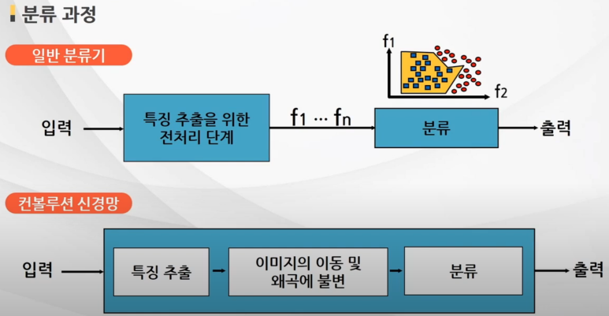
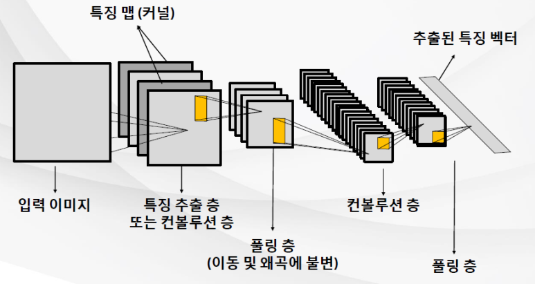
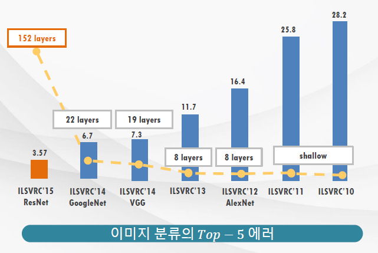



# [Tacademy] 인공지능을 위한 머신러닝 알고리즘 - 09강 컨볼루션 신경망

## **# 컨볼루션 신경망의 원리**

**※ 일반 신경망의 이미지 분류**

  · 이미지의 위치, 크기, 각도 변화 등에 취약함

  · 즉, 픽셀 상의 RGB 값(데이터의 위치)이 변화됨에 따라 입력 값이 변화하는데, 이런 변화에 적절히 대응하지 못한다는 문제점이 있음

**※ 컨볼루션 신경망**

  · 우리 뇌 속 피질의 신경 세포들은 물체의 방향과 장소가 바뀌어도 별 문제 없이 인식함

  · 이런 신경생물학적 관찰이 CNN 구조 설계의 기본이 됨

  · CNN은 다층 신경망의 한 종류로, 역전파 알고리즘을 사용하여 학습함

  · 물체의 위치와 방향 관계 없이 물체 고유의 특징을 학습

  · 즉, 이미지 픽셀 값으로부터 직접 시각 패턴을 학습

출처 : 강의 영상 중 캡처 / 일반 분류기와 딥러닝(중 CNN)의 분류 과정 비교

**※ CNN의 구조**

출처 : 강의 영상 중 캡처 / 컨볼루션 신경망의 구조

  · 컨볼루션 층과 풀링 층이 반복되는 구조

  · 컨볼루션 층 : 입력 이미지 속 다양한 위치에서 동일한 특징을 탐색

  · 컨볼루션 과정 : 입력 이미지 픽셀 값에 대하여 nxn 가중치 행렬과 dot product하여 특징맵을 결과로 얻음

  · 여기서 가중치 행렬은 역전파 알고리즘을 이용하여 그 값을 구함

  · 한 개의 특징 맵이 컨볼루션 과정을 통해 특징을 탐색할 때 특징 맵의 가중치 값은 고정

  · 따라서 입력 이미지 속 다양한 위치에 있는 동일한 특징을 탐색할 수 있음

  · 풀링 층 : 물체의 위치와 각도 변화에 대해 잘 반응할 수 있도록 해줌

  · 각 특징 맵의 해상도를 줄여서 모델의 파라미터 개수를 줄여줌

**※ CNN 응용 예제, LeNet5**

http://yann.lecun.com/exdb/lenet/

 · 장점 : 물체의 위치, 크기, 각도 변화에 대한 불변성, 노이즈와 왜곡에 대한 불변성

  · 단점 : 다층 퍼셉트론보다 더 많은 용량 차지, 많은 계산량(다른 신경망보다 3배 느림)

## **# ImageNet**

**※ 이미지 자동 분류 챌린지**

**※ 모델 성능 향상**

 · 모델의 깊이가 깊어질수록 에러는 감소함

출처 : 강의 영상 중 캡처, K-means의 예

