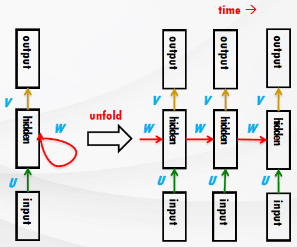
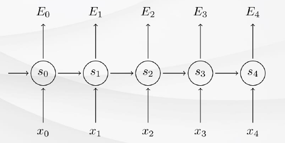



# [Tacademy] 인공지능을 위한 머신러닝 알고리즘 - 10강 재현 신경망

## **# RNN(Recurrent Neural Networks)의 원리**

**※ 시계열 데이터 학습 모델**

  · RNN은 시계열 데이터를 확률적으로 모델링 함

  · 연속된 데이터들의 집합에 대하여 매 시간 단위마다 다음 확률 값을 계산

  · 계산을 할 때 직전의 확률 정보까지 활용하기 때문에 은닉층을 '컨텍스트 층' 또는 '히스토리 층'이라고도 부름

  · 역전파를 사용하여 모델 파라미터를 학습시킴

**※ 파라미터**

출처 : 강의 영상 중 캡처

***s******t*** ***= tanh(Ux******t*** ***+ Ws******t-1******)***

***y******t******` = softmax(Vs******t******)***

  · U : 입력층과 은닉층 사이의 가중치 파라미터

  · V : 은닉층과 출력층 사이의 가중치 파라미터

  · W : 은닉층에 있는 유닛들끼리는 fully-connected 인데, 이 연결 사이의 가중치 값

  · 입력 유닛에 대한 가중치를 예산할 때, 은닉층에 존재하는 '이전 시간'의 유닛들 가중치를 포함해서 계산함

  · 은닉 유닛들은 연속된 벡터공간에서 이전 데이터 정보를 저장함

  · 많은 수의 뉴런과 충분한 시간이 있따면, RNN은 어떤 시계열 데이터도 학습할 수 있음

**※ 손실 함수**

출처 : 강의 영상 중 캡처

  · 모델이 예측한 클래스 정보를 갖고 있는 이진 벡터와 실제 클래스 정보(정답)의 차이를 t 시간별로 손실 함수를 통해 계산

  · t에서 손실 함수는 정답 클래스의 마이너스 로그 확률(negative log likelihood)이고, 이를 corss entropy라고도 함

  · 시계열 데이터 전체 집합의 손실 함수는 각 시간 단위의 손실 함수의 총 합

**※ 오류 역전파 과정**

  · BPTT, Back Propagation Through Time

  · 그라디언트 계산 과정에서 다수의 곱셈이 필요

  · 시간에 따른 오류 역전파 과정이 생기는 이유는 같은 파라미터 w를 매 시간 단위마다 반복해서 사용하기 때문

**※ 그라디언트 손실 발생**

  · 활성함수의 미분 값을 여러번 곱하는 경우 그라디언트의 값이 0으로 수렴

  · 따라서 시간에 대한 길이가 깊어질수록 학습이 되지 않음

**※ 그라디언트 폭발 발생**

  · 파라미터 값이 큰 경우, 그라디언트 값이 매우 커져서 NaN 또는 프로그램 종료 발생

  · Gradient Clipping을 통해서 해결 가능

## **# GRU, LSTM**

**※ GRU(Gated Recurrent Units)**

  · 일반적 RNN은 매 시간마다 은닉층을 직접 계산

  · GRU는 현재 입력 데이터와 은닉층을 기반으로 업데이트 게이트(Update Gate)를 계산하고, 다른 파라미터를 사용하여 리셋 게이트(Reset Gate)를 계산

  · 잠재적 은닉 유닛 계산 : 만약 리셋 게이트가 0이면, 이전 단계까지 계산한 은닉 유닛을 고려하지 않고, 현재 시간 단계의 계산 정보만 반영

  · 최종적으로 사용하는 은닉 유닛은 현재 계산한 잠재적 은닉 유닛과 이전까지의 은닉 유닛을 업데이트 게이트에 사용하여 조합

**※ LSTM(Long Short Term Memory)**

  · GRU에 출력 게이트를 추가한 구조

  · 따라서 최종 은닉 유닛 계산 과정에 한 단계가 추가 됨

  · 데이터 개수가 많은 경우에 LSTM 모델이 더 좋은 성능을 보임

**※ ESN(Echo State Networks)**

  · 길이가 긴 시계열 데이터를 효율적으로 학습

  · 많은 수의 은닉 유닛 개수를 필요로 하고, 유닛 사이는 매우 밀도가 낮음

## **# 텍스트 생성**

**※ 언어 모델링**

  · 문장이 나타날 확률을 계산하는 것이 목표

  · 확률 P(w)는 체인룰을 사용하여 단어들의 조건부 확률들의 곱으로 나타냄

  · 이전 단어들의 집합이 컨텐스트로 주어지면, 다음 단어가 등장할 확률의 연속적인 곱셈으로 나타나게 됨

  · RNN을 사용하면 매 시간 단위마다 단어를 생성

  · 매 시간 단위마다 은닉 유닛은 이전 시간까지 생성한 단어들의 정보를 가지고 있음

  · 단, 길이가 매우 긴 문장의 경우에는 의미 있는 문장을 생성하기 어려움

출처 : 강의 영상 중 캡처

