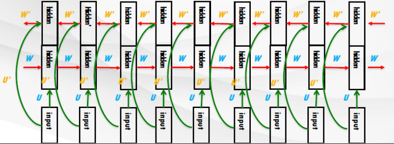
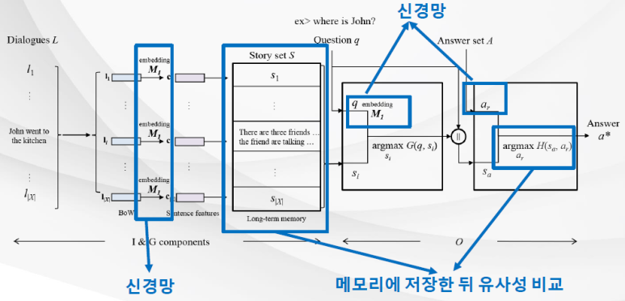
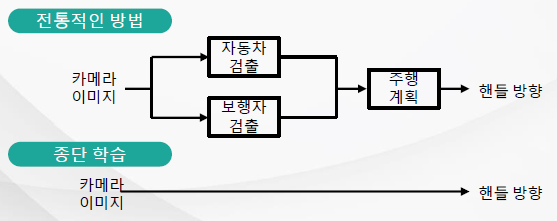



# [Tacademy] 인공지능을 위한 머신러닝 알고리즘 - 11강 메모리 네트워크

## **# 메모리 네트워크**

**※ RNN의 메모리**

  · 은닉유닛들은 연속된 벡터공간에서 이전 데이터 정보를 저장

  · 데이터의 길이가 긴 경우 은닉 유닛 벡터는 많은 입력 정보를 저장해야 함

**※ 양방향 재현 신경망(bi-directional RNN)**

출처 : 강의 영상 중 캡처

  · 앞 방향 RNN : 입력 데이터 원본의 가장 앞 단어부터 인코더 RNN의 입력으로 주어짐

  · 뒤 방향 RNN : 입력 데이터 원본의 가장 뒤 단어부터 인코더 RNN의 입력으로 주어짐

  · 인코더 RNN의 은닉 유닛은 앞/뒤 방향 RNN의 은닉 유닛을 단순하게 이어 붙인 구조

  · 따라서 앞에서부터 뒤의까지 정보를 모두 포함하게 되고, 중간 입력 데이터에 대해서도 정보를 가질 수 있음

**※ 히든 유닛 벡터 저장**

  · 은닉 유닛 벡터의 값을 각 시간마다 RAM에 저장하는 방식

  · 따라서 입력 데이터의 각 시간마다의 적절한 '답' 단어를 저장하고 있는 것

**※ 메모리 네트워크**

  · 질의 응답 모듈 : 스토리 선택 모듈, 답변 선택 모듈

  · 적절성 평가 함수

  · 학습 : Triplet Loss

출처 : 강의 영상 중 캡처

## **# 종단 메모리 네트워크**

**※ End to End Learning Model**

출처 : 강의 영상 중 캡처 / 기존 방식과 종단 학습의 차이

출처 : 강의 영상 중 캡처 / 기존 방식과 종단 학습의 차이

  · 주어진 문제 해결을 위해 유용한 내부적 특징 표현들을 스스로 학습

  · 다양한 중간 단계의 과정을 학습 알고리즘 하나로 통합하여 전체 작업을 종단으로 수행

  · 기존 메모리 네트워크의 스토리 선택 모듈을 학습시키기 위해서는 질의에 대한 적절한 스토리 정보를 추가로 구축해야 하는데, 이 비용이 큼

  · 종단 학습 메모리 네트워크는 훈련 과정에서 추가적인 감독 과정이 필요하지 않음

## **# 메모리 네트워크의 언어학습**

**※ bAbl Task**

  · 모델의 언어 이해 및 추론 능력을 테스트

  · 메모리 네트워크를 통한 질의 응답 모델