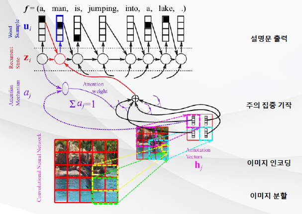



# [Tacademy] 인공지능을 위한 머신러닝 알고리즘 - 12강 딥러닝 응용 사례

## **# 구글 번역기의 원리**

**※ 기존 번역기의 문제점**

  · 자동 번역을 위해 통계적 방식을 사용

  · 이를 위해서 과도한 메모리를 사용했어야 함

  · 데이터를 단어 또는 구문 기준으로 정렬했는데, 어떤 정렬 정보를 처음에 사용하느냐에 따라 번역 결과가 달라짐

  · 단어/구문 번역 모델은 의미상 비슷한 단어/구문을 고려하지 않고, 표면적인 동시 등장 횟수에만 고려한 결과를 보여줌

**※ 단일 신경망을 이용한 문장 모델링**

  · RNN을 이용해 문장이 나타날 확률을 모델링

  · 매 시간 단위마다 확률 값을 계산하고, 이를 은닉층에 저장

  · 역전파를 이용해 모델 파라미터를 학습

**※ 두 개의 신경망을 이용한 기계 번역**

  · 두 RNN을 이용해서 문장을 입력했을 때 번역 결과를 얻는 확률을 계산하는 모델링

  · 인코더 재현 신경망 : RNN의 은닉층은 컨텍스트(히스토리) 정보를 저장, 전체 입력 문장의 정보를 종합적으로 저장

  · 디코더 재현 신경망 : 각 시간 단위마다 RNN은 입력 문장의 전체 정보, 이전 시간 단계에서의 결과(생성한 단어), 은닉 유닛 정보를 기반으로 다음 단어 예측

  · 디코더 RNN은 다른 데이터로 학습된 pre-trained RNN의 파라미터를 초기 파라미터로 사용할 수 있음

**※ 신경망 기반 기계 번역의 특징**

  · 경사하강법을 이용하여 종단 학습 가능(즉, 입력부터 출력까지 어떠한 감독도 불필요)

  · 인코더/디코더 RNN은 원본 문장과 타겟 문장을 분산 표현으로 나타냄

  · 번역 문제를 은닉 유닛 공간을 사용하여 학습함

  · 기존 통계적 방식과 달리, 미리 정의된 단어 정렬 방식을 사용하지 않음

  · 따라서 통계적 방식에 비해 적은 파라미터 개수를 사용(더 적은 메모리 사용)

## **# 메모리 & 주의 집중 기작**

**※ 인코더&디코더 RNN의 문제점**

  · 인코더 RNN의 가장 마지막 시간 은닉 유닛은 입력된 모든 문장의 정보를 담고 있어야 함

  · 만약 입력 길이가 길어진 경우, 당연히 인코딩해야 할 정보가 많아짐

  · 이 때, 제한된 은닉 유닛의 크기 안에 입력 정보를 모두 인코딩해야 하는 문제

  · 따라서 최근 입력된 정보는 잘 반영하지만, 오래 전에 입력된 정보는 손실될 수 있음

**※ 해결책, 양방향 재현 신경망(bi-directional RNN)**

  · 앞 방향 RNN : 입력 데이터의 앞 부분부터 인코딩

  · 뒤 방향 RNN : 입력 데이터의 뒤 부분부터 인코딩

  · 인코더 RNN의 은닉 유닛은 앞/뒤 방향 RNN의 은닉 유닛을 단순히 이어 붙임

  · 그 결과, 오래 전에 입력된 단어의 정보도 가질 수 있게 됨

  · 이는 입력 문장 전체 길이만큼의 은닉 유닛 개수를 저장하기 위해 '메모리'를 사용하는 방법

**※ 주의 집중 기작**

  · 디코더 RNN의 입력에 인코더 RNN 은닉 유닛들의 선형 조합을 사용함

  · 즉, 인코더 신경망의 각 은닉 유닛은 입력 문장에서 한 개의 단어 정보를 인코딩(이 때 은닉 유닛들의 가중치의 합은 1)하고, 번역기에서 출력되는 단어들은 가중치에 따라 입력으로 주어진 단어들을 선별적으로 고려

  · 이는 단어에 따라 선별하는 '주의 집중' 방법

**※ GNMT(구글 자동 번역기), 2016.11.**

  · RNN 대신 GRU 사용 : 인코더용 8층, 디코더용 8층

  · 주의 집중 기작을 위해 3층짜리 신경망 사용

**※ 자동 번역기의 성능 측정**

  · BLEU ; BiLingual Evaluation Understudy

## **# 언어와 시각의 결합(with DL)**

**※ 신경망을 이용한 이미지 번역**

출처 : 강의 영상 중 캡쳐 / 이미지 번역 과정(using 신경망)

  · 이미지 번역 : 이미지를 입력했을 때, 이미지에 대한 설명 문장을 출력하는 것

  · 한 개의 CNN과 RNN이 이미지에 대한 설명문이 나타날 확률을 모델링

  · 인코더 CNN : 전체 이미지를 CNN으로 인코딩 하기 위해 부분 이미지 마다의 벡터 값을 저장. 이는 인코더 RNN이 시간 단위마다 은닉 유닛의 결과를 저장하듯이, 부분 이미지마다의 벡터를 저장하는 것.

  · 디코더 RNN : 각 시간 단위마다 RNN은 입력 이미지의 정보, 이전 시간 단계에서 생성된 단어, 디코더 RNN의 은닉 유닛 정보를 기반으로 다음 단어 예측